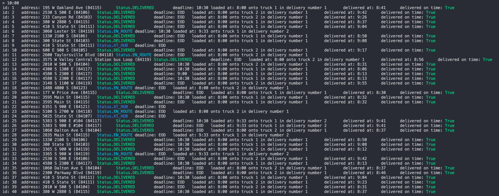

A. Identify a named self-adjusting algorithm (e.g., “Nearest Neighbor
algorithm,” “Greedy algorithm”) that you used to create your program to deliver
the packages.

    In order to load the packages onto the trucks I used a combination of a
    nearest-neighbor algorithm and a greedy algorithm, i.e. after loading a
    package onto one truck, the algorithm will load that truck until there are
    no more available packages (greedy), and it will choose the next package
    according to the distance between the next package and the previously-loaded
    package (nearest-neighbor).

B. Write an overview of your program, in which you do the following:

1.  Explain the algorithm’s logic using pseudocode.

```
initialize Trucks
initialize Packages
initialize Graph

While priority packages remain
    For each Truck of Trucks
        Until Truck is full or no priority packages remain
            Load Truck with nearest priority

        Deliver priority packages

While packages available for delivery
    For each Truck of Trucks
        Load package closest to the previously-loaded package's destination
```

2.  Describe the programming environment you used to create the Python
    application.

    To complete this application, I used Python 3.9 and Visual Studio Code along
    with the Pylance extension and its dependencies.

3.  Evaluate the space-time complexity of each major segment of the program, and
    the entire program, using big-O notation.

4.  Explain the capability of your solution to scale and adapt to a growing
    number of packages.

    My solution doesn't assume a fixed number of packages, trucks, or
    destinations, which means it can continue to grow with packages until the
    algorithms themselves are no longer efficient enough to quickly enough
    determine how to deliver the packages.

5.  Discuss why the software is efficient and easy to maintain.

    The software is efficient because it is able quickly determine a short route
    for both trucks to travel while still meeting all the requirements. It is
    easy to maintain due to the presence of comments and static typing which
    helps reduce type errors.

6.  Discuss the strengths and weaknesses of the self-adjusting data structures
    (e.g., the hash table).

C. Write an original program to deliver all the packages, meeting all
requirements, using the attached supporting documents “Salt Lake City Downtown
Map,” “WGUPS Distance Table,” and the “WGUPS Package File.”

1.  Create an identifying comment within the first line of a file named
    “main.py” that includes your first name, last name, and student ID.

[X]

2.  Include comments in your code to explain the process and the flow of the
    program.

[X]

D. Identify a self-adjusting data structure, such as a hash table, that can be
used with the algorithm identified in part A to store the package data.

1.  Explain how your data structure accounts for the relationship between the
    data points you are storing.

Note: Use only appropriate built-in data structures, except dictionaries. You
must design, write, implement, and debug all code that you turn in for this
assessment. Code downloaded from the Internet or acquired from another student
or any other source may not be submitted and will result in automatic failure of
this assessment.

G. Provide an interface for the user to view the status and info (as listed in
part F) of any package at any time, and the total mileage traveled by all
trucks. (The delivery status should report the package as at the hub, en route,
or delivered. Delivery status must include the time.)

1.  Provide screenshots to show the status of all packages at a time between
    8:35 a.m. and 9:25 a.m.

9:00 AM screenshot:


2.  Provide screenshots to show the status of all packages at a time between
    9:35 a.m. and 10:25 a.m.

10:00 AM screenshot:



3.  Provide screenshots to show the status of all packages at a time between
    12:03 p.m. and 1:12 p.m.

12:00 PM screenshot:


H. Provide a screenshot or screenshots showing successful completion of the
code, free from runtime errors or warnings, that includes the total mileage
traveled by all trucks.

I. Justify the core algorithm you identified in part A and used in the solution
by doing the following:

1.  Describe at least two strengths of the algorithm used in the solution.

    The algorithm is scalable. It makes no assumptions about the number of
    trucks, packages, or destinations, and it should therefore be able to
    accommodate an increase in any of them.

    The algorithm finds an efficient solution for the given requirements in that
    both trucks must travel fewer than 80 miles to deliver all the packages.

2.  Verify that the algorithm used in the solution meets all requirements in the
    scenario.

    The requirements have been met and this is verifiable by using option 3 in
    the app. There you can find loading times, delivery times, which truck
    delivered the package and with what other packages the package was
    delivered.

    Additionally there are errors in place that will throw if a requirement
    isn't met at runtime and there are unit tests validating the requirements as
    well.

3.  Identify two other named algorithms, different from the algorithm
    implemented in the solution, that would meet the requirements in the
    scenario.

    The Dijkstra algorithm could be used to generate a more intelligent delivery
    path than simply always taking the next closest package.

a. Describe how each algorithm identified in part I3 is different from the
algorithm used in the solution.

J. Describe what you would do differently, other than the two algorithms
identified in I3, if you did this project again.

K. Justify the data structure you identified in part D by doing the following:

1.  Verify that the data structure used in the solution meets all requirements
    in the scenario.

a. Explain how the time needed to complete the look-up function is affected by
changes in the number of packages to be delivered.

b. Explain how the data structure space usage is affected by changes in the
number of packages to be delivered.

c. Describe how changes to the number of trucks or the number of cities would
affect the look-up time and the space usage of the data structure.

2.  Identify two other data structures that could meet the same requirements in
    the scenario.

a. Describe how each data structure identified in part K2 is different from the
data structure used in the solution.

L. Acknowledge sources, using in-text citations and references, for content that
is quoted, paraphrased, or summarized.

M. Demonstrate professional communication in the content and presentation of
your submission.
